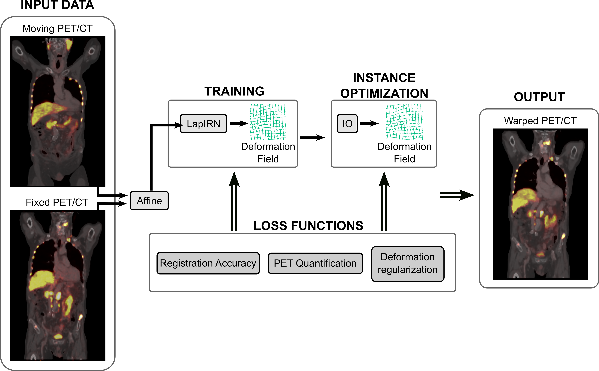

# PSMAReg — Quantification-Preserving Registration for Longitudinal Whole-Body PSMA PET/CT

Team **koegl**'s submission to [Learn2Reg 2026](https://learn2reg.grand-challenge.org/),
**[Task 1 — PSMAReg](https://www.codabench.org/competitions/15724/)**: registration of
pre-therapy (baseline, *fixed*) and follow-up (*moving*) whole-body PSMA PET/CT scans,
with an explicit constraint on PET-derived biomarkers.

<p align="center">
  
</p>

## Method

A three-stage pipeline built on the diffeomorphic, coarse-to-fine **LapIRN** architecture
([Mok & Chung, MICCAI 2020](https://doi.org/10.1007/978-3-030-59716-0_21); BibTeX under
[Citation](#citation)):

1. **Affine pre-registration.** ANTs estimates a CT-only affine transform per pair
   (body masks, CT windowed to [−1000, 1000] HU, half resolution, Mattes mutual
   information). It is converted to a dense field and applied to the moving scan.
2. **Deformable registration.** A three-level Laplacian pyramid (quarter, half and full
   resolution). Each level takes four channels — fixed CT, fixed PET, affinely aligned
   moving CT, moving PET — predicts a stationary velocity field, adds it to the
   upsampled velocity of the coarser level, and exponentiates it by scaling and squaring,
   which keeps the transform diffeomorphic. Levels are trained sequentially, each finer
   level initialised from the previous one. Image similarity is computed on **CT only**,
   since PET uptake legitimately changes after therapy; PET enters as network input and
   through the preservation losses.
3. **Instance optimization (IO).** At test time each pair is refined by optimising a
   *residual* velocity field on top of the network prediction, initialised at zero and
   exponentiated the same way, so the refinement stays diffeomorphic. It uses the
   training objective; the best-scoring iterate (DSC, HD95, MTV, TLG) is kept.

The affine and the deformable field are composed into a single total transform.

**Losses.** One weighted objective drives both training and IO: CT-only local NCC and
organ-label Dice for accuracy; MTV, lesion-Jacobian and TLG preservation terms for PET
quantification; and per-bone rigidity, diffusion smoothness and a differentiable
folding (NDV) penalty for regularization. The two coarser levels drop the PET and
rigidity terms.

## Inputs and outputs

The dataset is not redistributed here. Access through the [challenge page](https://www.codabench.org/competitions/15724/); the paths below are the layout it ships in.

**Input** — four NIfTI volumes per pair, as released by the challenge:

| | file | role |
|---|---|---|
| fixed CT | `PSMARegPSMA_XXXX_0000_00.nii.gz` | baseline |
| fixed PET | `PSMARegPSMA_XXXX_0001_00.nii.gz` | baseline |
| moving CT | `PSMARegPSMA_XXXX_0000_01.nii.gz` | follow-up |
| moving PET | `PSMARegPSMA_XXXX_0001_01.nii.gz` | follow-up |

All volumes are 192 × 192 × 288 voxels at 2.7344 × 2.7344 × 3.27 mm; no further geometric
preprocessing is applied. Intensities are clipped (CT to [−1000, 1500] HU, PET SUV to
[0, 20]) and rescaled to [0, 1] internally.

**Output** — one dense displacement field per pair, `disp_XXXX_00_XXXX_01.nii.gz`:
channel-first `(3, 192, 192, 288)`, in **voxel units**, mapping the moving (follow-up)
scan into the fixed (baseline) frame.

Training additionally consumes the CT organ labels and PET lesion labels. For cases
without released labels these are generated: TotalSegmentator in fast mode for CT
organs, and an nnU-Net trained on this cohort for PET lesions.

## Results

Official Learn2Reg 2026 evaluation-server numbers. The hidden **test** results are not
available yet and will be added here once the organizers release them.

| leaderboard | rank | DSC (%) ↑ | HD95 (mm) ↓ | MTV error (%) ↓ | TLG error (%) ↓ | NDV (%) ↓ |
|---|---|---|---|---|---|---|
| validation | 7/45 | 78.9 ± 3.8 | 5.99 ± 2.39 | 1.56 ± 1.22 | 4.18 ± 2.49 | 0.0041 ± 0.0024 |
| **test** | — | — | — | — | — | — |

## What is in this repository

| path | what it is |
|---|---|
| `train.py` | training entry point — one pyramid level per invocation |
| `inference.py` | inference on a single pair: affine → network → optional IO → displacement field |
| `evaluate.py` | score displacement fields: DSC, HD95, MTV, TLG, NDV |
| `psmareg/` | the method itself: model, losses, data pipeline, affine stage, instance optimization, config |
| `split.json` | the paper's patient-level train/validation split |

## Weights

Neither checkpoint is in the repository; both are attached to the
[latest release](../../releases/latest), with a `SHA256SUMS` alongside them.

| asset | size | what |
|---|---|---|
| `psmareg_registration.pth` | 3.6 MB | the LapIRN pyramid — pass to `--weights` |
| `psmareg_lesion_nnunet.tar.gz` | 219 MB | the PET lesion nnU-Net — extract, pass the folder to `--lesion-model` |

```bash
curl -LO https://github.com/koegl/psmareg/releases/latest/download/psmareg_registration.pth
```

```bash
curl -LO https://github.com/koegl/psmareg/releases/latest/download/psmareg_lesion_nnunet.tar.gz && tar xzf psmareg_lesion_nnunet.tar.gz
```

Both are already baked into the container, which needs neither download.

## Installation

Python 3.11, CUDA 12.x, one GPU with ≥ 24 GB VRAM for inference.

```bash
python3.11 -m venv .venv
source .venv/bin/activate
pip install --upgrade pip
pip install -r requirements.txt
```

Tested with torch 2.6.0+cu124, numpy 2.3.5, scipy 1.15.3, nibabel 5.4.2, antspyx 0.6.3
and nnunetv2 2.8.1 on an NVIDIA RTX A6000.

## Running the container

Requires [Docker Engine](https://docs.docker.com/engine/install/) and the [NVIDIA Container Toolkit](https://docs.nvidia.com/datacenter/cloud-native/container-toolkit/latest/install-guide.html).

Pull the image from [`ghcr.io/koegl/psmareg`](https://github.com/users/koegl/packages/container/package/psmareg) (public, no login needed):

```bash
docker pull ghcr.io/koegl/psmareg:v1.0.0
```

Then register one pair — five positional paths, in this order (fixed CT, fixed PET,
moving CT, moving PET, output field):

```bash
docker run --rm --ipc=host --memory 60g --gpus "device=0" --user $(id -u):$(id -g) --network=none --mount type=bind,source=<image dir>,target=/app/input,readonly --mount type=bind,source=<output dir>,target=/app/output ghcr.io/koegl/psmareg:v1.0.0 /app/input/PSMARegPSMA_0001_0000_00.nii.gz /app/input/PSMARegPSMA_0001_0001_00.nii.gz /app/input/PSMARegPSMA_0001_0000_01.nii.gz /app/input/PSMARegPSMA_0001_0001_01.nii.gz /app/output/disp_0001_00_0001_01.nii.gz
```

No other arguments are needed. The image is self-contained (all weights baked in, runs
with `--network=none`) and needs 1 GPU (24 GB), ~8 GB RAM and ~90 s per pair — a fixed
time budget within which instance optimization runs as many steps as fit.

## Training

Levels are trained in order, each initialised from the previous one:

```bash
python train.py --data-dir /path/to/PSMAReg_dataset --out-dir runs/psmareg --level 1
```

```bash
python train.py --data-dir /path/to/PSMAReg_dataset --out-dir runs/psmareg --level 2 --init runs/psmareg/level1_best.pth
```

```bash
python train.py --data-dir /path/to/PSMAReg_dataset --out-dir runs/psmareg --level 3 --init runs/psmareg/level2_best.pth
```

`--data-dir` is the challenge layout (`imagesTr/`, `labelsTr/`). The paper's
patient-level split, [`split.json`](split.json), is read by default, and the defaults in
[psmareg/config.py](psmareg/config.py) are the reference run (≈ 2 d 6 h in total on one
H100 80 GB).

## Inference

Without the container, on a single pair:

```bash
python inference.py --fixed-ct fixed_ct.nii.gz --fixed-pet fixed_pet.nii.gz --moving-ct moving_ct.nii.gz --moving-pet moving_pet.nii.gz --weights psmareg_registration.pth --out disp.nii.gz
```

Affine pre-registration, the network, and the composition of the two: about 21 s per
pair on an RTX A6000, most of it the CPU-bound ANTs affine.

### Instance optimization

`--io` refines the field for the pair. It uses a moving PET lesion mask and CT organ
labels for both scans, either supplied:

```bash
python inference.py ... --io --moving-lesion lesion.nii.gz --moving-labels moving_labels.nii.gz --fixed-labels fixed_labels.nii.gz
```

or predicted — organs by TotalSegmentator, lesions by an nnU-Net we trained on this
dataset (the extracted `psmareg_lesion_nnunet` from [Weights](#weights)):

```bash
python inference.py ... --io --lesion-model psmareg_lesion_nnunet
```

A missing label only disables the loss terms that need it. To reproduce the submission,
use this lesion model — the MTV and TLG terms are computed on its mask.

## Evaluation

Score a directory of displacement fields:

```bash
python evaluate.py --fields runs/predictions --data-dir /path/to/PSMAReg_dataset --csv metrics.csv
```

It reads every `disp_<case>_<fixed>_<case>_<moving>.nii.gz` — the naming the container writes — and reports DSC, HD95, MTV and TLG error and NDV per pair, then their means.
CT organ labels and PET lesion masks are taken from the dataset's label directory.

To score MTV and TLG against different lesion masks — predicted ones, say — point `--lesion-masks` at a directory holding them, named as the labels are (`PSMARegPSMA_<case>_0001_<timepoint>.nii.gz`):

```bash
python evaluate.py --fields runs/predictions --data-dir /path/to/PSMAReg_dataset --lesion-masks runs/segmentations
```

## Licence

MIT, see [LICENSE](LICENSE). The pyramid in [psmareg/model.py](psmareg/model.py) derives
from [LapIRN](https://github.com/cwmok/LapIRN) (MIT, Tony C. W. Mok), whose copyright
notice is retained there.

## Citation

```bibtex
@inproceedings{psmareg2026,
  title     = {PET Quantification-Preserving Registration for Longitudinal Whole-Body PSMA PET/CT},
  author    = {Anonymous},
  booktitle = {Learn2Reg 2026},
  year      = {2026}
}
```

This work builds on LapIRN, which should be cited alongside it:

```bibtex
@InProceedings{10.1007/978-3-030-59716-0_21,
  author    = {Mok, Tony C. W. and Chung, Albert C. S.},
  editor    = {Martel, Anne L. and Abolmaesumi, Purang and Stoyanov, Danail
               and Mateus, Diana and Zuluaga, Maria A. and Zhou, S. Kevin
               and Racoceanu, Daniel and Joskowicz, Leo},
  title     = {Large Deformation Diffeomorphic Image Registration with Laplacian Pyramid Networks},
  booktitle = {Medical Image Computing and Computer Assisted Intervention -- MICCAI 2020},
  year      = {2020},
  publisher = {Springer International Publishing},
  address   = {Cham},
  pages     = {211--221},
  isbn      = {978-3-030-59716-0}
}
```
